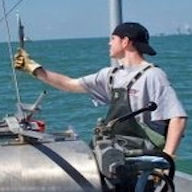
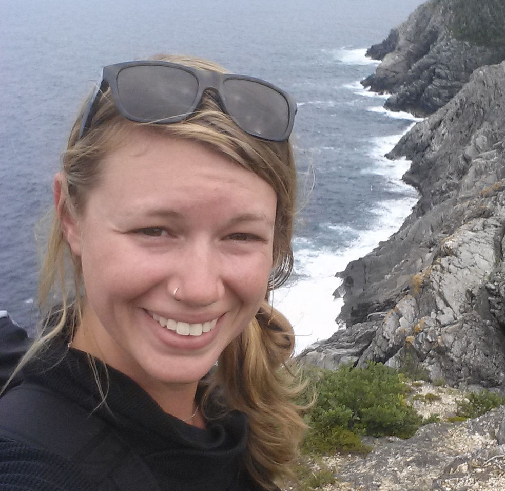
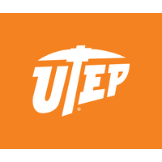

# PEP Summer 2020 Internship <a href="https://www.woodsholediversity.org/pep/">:sparkles:</a>

## Sea Turtle Ecology Team members
<table>
    <tr>
        <td align = "center">
            
             <b>Heather Haas, PhD</b></a> 
            <a href="" title="Code">:turtle:</a>
        </td>
        <td align = "center">
            
             <b>Joshua Hatch</b></a> 
            <a href="" title="Code">:computer::ship:</a>
        </td>
        <td align = "center">
            
             <b>Leah Crowe</b></a> 
            <a href="" title="Code">:airplane::computer::ship:</a>
        </td>
        <td align = "center">
            
             <b>Rick Rogers</b></a> 
            <a href="" title="Code">:computer:</a>
        </td>
        <td align = "center">
            
             <b>Kate Choate</b></a> 
            <a href="" title="Code">:computer:</a>
        </td>
        <td align = "center">
            
             <b>Christopher Sandoval</b></a> 
            <a href="" title="Code">:computer:</a>
        </td>
    </tr>
</table>

## Meetings
| Meeting type | Title | Date | Notes | Materials |
| :---: | :---: | :---: | :---: | :---: |
| Virtual | Introductions | May 29, 2020 | Click [here](https://docs.google.com/document/d/1iqOUm5e4UyHBLjaCJyvbvfXfv8V2INnmWWQokkJhZqE/edit?usp=sharing) | [Mentor-mentee Agreement](https://docs.google.com/document/d/1U9JwfIqtUa--cNdYOpbBjmLP1cpyFvBQqz4LzOSyZeI/edit?usp=sharing) |
| Virtual | Week 1 | June 5, 2020 | Click [here](https://docs.google.com/document/d/13_i8dGmxDLojX-7ZNn7idtqVwm94vd96K8r4ozlZMAQ/edit?usp=sharing) | None |

## Schedule
| Week | Title | Date | Materials |
| :---: | :---: | :---: | :---: |
| 1 | Gitting started | June 8, 2020 | [README](week_1) | 
| 2 | Workflow | June 15, 2020 | [README](week_2) | 

## References (reading materials)

### Compressing Dive Data 
* [Fedak et al. 2001](refs/Fedak01 two approaches.pdf)
* [Fedak et al. 2002](refs/Fedak_2002_Overcoming_constraints.pdf)
* [Photopoulou et al. 2014](refs/Photopoulou et al. 2014.pdf)

### Sea Turtle Diving Behavior
* [Hochscheid 2014](refs/HochscheidJEMBE2014.pdf)

## Credits
We should stand on the shoulders of giants! That being said, a lot of the materials presented here were taken from the course website [Introduction to Data Science](https://datasciencelabs.github.io/) and [Happy Git and GitHub for the UseR](https://happygitwithr.com/). We can't thank them enough for making their course materials publicly available.