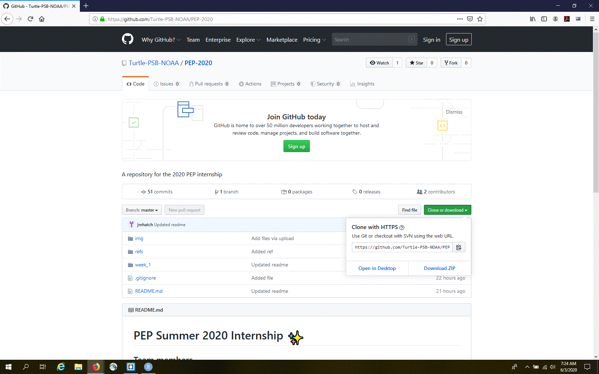

Week 2
======

Now that we have all of the necessary tools installed, we need to start
integrating them to allow for a collaborative and reproducible workflow.
To do this we’re going to use Git and GitHub through the RStudio
[IDE](https://en.wikipedia.org/wiki/Integrated_development_environment).
Just a quick reminder of what we covered last week:

1.  You signed up for a free GitHub account
2.  You installed Git
3.  You installed / updated R à la RStudio
4.  You made sure RStudio could detect Git on your local machine

1 - GitHub first, RStudio second
--------------------------------

### Fork a repo on GitHub

The PEP 2020 internship with the Sea Turtle Ecology Team already has a
GitHub repo (see [here](https://github.com/Turtle-PSB-NOAA/PEP-2020)),
so we can use that as a starting point to collaborate. “Fork and clone”
is Git / GitHub speak for copying someone else’s repo into your GitHub
account.

First, sign into GitHub and navigate to the
[PEP-2020](https://github.com/Turtle-PSB-NOAA/PEP-2020) repo.

In the upper right hand corner, click **Fork**.

Voilà! Now you should have a copy of the PEP-2020 repo in your GitHub
account.

### Clone a repo via RStudio

Now we need to **clone** the forked repo from your GiHub account to your
local machine.

In RStudio, start a new project:

-   *File &gt; New Project &gt; Version Control &gt; Git*. In the
    “repository URL” paste the URL of the forked GitHub repository from
    your GitHub account. It will be something like this
    <a href="https://github.com/jmhatch/PEP-2020.git" class="uri">https://github.com/jmhatch/PEP-2020.git</a>
    
-   Be intentional about where you create this project
-   Suggest you “Open in new session”
-   Click “Create Project” to create a new directory, which will be all
    of these things:
    -   a directory or “folder” on your computer
    -   a Git repository, linked to a remote GitHub repository
    -   an RStudio Project

This should download all of the files from the GitHub PEP-2020 repo onto
your local mahcine. Look in RStudio’s file browser pane to see all of
the downloaded files. This is known as the `master` (or default) branch.

### Set the remote `upstream` repo

It’s a good idea to set the remote `upstream` repo to your `master`
branch in case you need to pull changes. To do this we’re going to click
on “New Branch” in the Git pane. This will reveal a button to “Add
Remote”. Click it. Enter `upstream` as the remote name and paste the URL
<a href="https://github.com/Turtle-PSB-NOAA/PEP-2020.git" class="uri">https://github.com/Turtle-PSB-NOAA/PEP-2020.git</a>.
Click “Add”. Decline the opportunity to add a new branch by clicking
“Cancel”.

Now let’s take a look at the current remotes for our local repo in the
shell (*Tools &gt; Shell…*):

`git remote -v`

You should see four repos listed, two labaled with `origin` and two
labeled with `upstream`.

2 - Work locally
----------------

### Never alter `master`

To work on the local PEP-2020 repo we first need to create a branch
(named something other than `master`), which will make things easier
later on.

To do this we’re going to click on “New Branch” in the Git pane.

Provide a name for the branch. I usually just prefix the repo name with
“fix-”, so in this example the branch would be named “fix-PEP-2020”.

<!-- Ensure that the "Remote:" is set to `origin`. -->
<!-- Click "Create". -->

### Pull changes from `upstream`

To pull changes from `upstream` into your `master` copy you will need to
open a shell (*Tools &gt; Shell…*) and type:

`git pull upstream master --ff-only`

**NOTE**: Make sure you’re on the `master` branch before running the git
command above. Unfortunately, you cannot do this from RStudio.

#### Update branch with `master`

In order to reflect the upstream changes made to `master` in the branch
`fix-PEP-2020` (or whatever you called it), you will need to switch to
the `fix-PEP-2020` branch and run:

`git merge master`

Now the working branch will be up to date with `master`.

### Update fork

After making all the commits to your working branch, you should push
changes to your forked repo.

<!-- You can use the green “Push” button in RStudio to do this. -->
