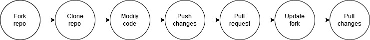
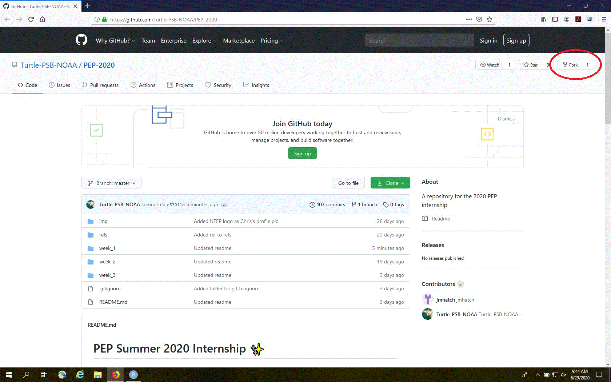

Week 2
======

Now that we have all of the necessary tools installed, we need to start
integrating them to allow for a collaborative and reproducible workflow.
To do this we’re going to use Git and GitHub through the RStudio
[IDE](https://en.wikipedia.org/wiki/Integrated_development_environment).
Just a quick reminder of what we covered last week:

1.  You signed up for a free GitHub account
2.  You installed Git
3.  You installed / updated R à la RStudio
4.  You made sure RStudio could detect Git on your local machine

Overview
--------

1.  Create a Fork
2.  Clone your Fork
3.  Modify the Code
4.  Push your Changes
5.  Create a Pull Request
6.  Update your Fork
7.  Pull Changes

1 - GitHub first, RStudio second
--------------------------------

### Fork a repo on GitHub

The PEP 2020 internship with the Sea Turtle Ecology Team already has a
GitHub repo (see [here](https://github.com/Turtle-PSB-NOAA/PEP-2020)),
so we can use that as a starting point to collaborate. “Fork” is Git /
GitHub speak for copying someone else’s repo into your GitHub account.
After forking, you can make changes to the repo without affecting the
original version.

First, sign into GitHub and navigate to the
[PEP-2020](https://github.com/Turtle-PSB-NOAA/PEP-2020) repo.

In the upper right hand corner, click “Fork”.

Voilà! Now you should have a copy of the PEP-2020 repo in your GitHub
account. An important thing to note is that GitHub will not sync changes
made in the original repository (upstream repo) with your forked copy.

### Clone a repo via RStudio

Now we need to “clone” the forked repo from your GiHub account to your
local machine.

In RStudio, start a new project:

-   Click *File &gt; New Project &gt; Version Control &gt; Git*. In the
    “repository URL” paste the URL of the forked GitHub repository from
    your GitHub account. It will be something like this
    <a href="https://github.com/" class="uri">https://github.com/</a><GitHub user name>/PEP-2020.git
-   Be intentional about where you create this project
-   Suggest that you “Open in new session”
-   Click “Create Project” to create a new directory, which will be all
    of these things:
    -   a directory or “folder” on your computer
    -   a Git repository, linked to a remote GitHub repository
    -   an RStudio Project

This should download all of the files from the GitHub PEP-2020 repo onto
your local mahcine. Look in RStudio’s file browser pane to see all of
the downloaded files. This is known as the `master` (or default) branch.
The remote, forked repo on GitHub is, by default, known as the
`origin/master` branch.

2 - Start working
-----------------

If you ever want to work on multiple pull requests at once, then it will
be worth your while (actually necessary) to learn more about branches.
Without getting too much into the weeds, each pull request you make is
bound to a branch of a git / GitHub repo. For our purposes, we will
never be making multiple pull requests at once. So we will just modify
the local clone (ie, `master`), commit any changes, and then push those
changes to the remote fork (ie, `origin/master`) using the green “Push”
button in the git panel of RStudio.

3 - Time to merge
-----------------

### Create a pull request

TBD

### Update Fork

TBD

### Pull changes from remote fork to local clone

This one is easy, just use the blue “Pull” button in the git panel of
RStudio.
